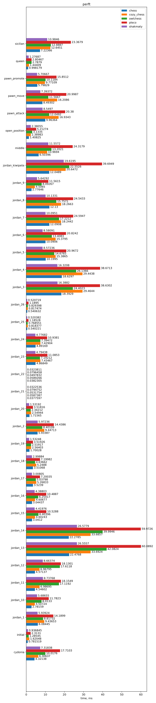
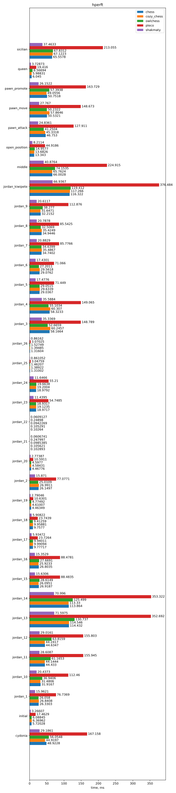

# Tests and benchmarks for chess implementations in Rust

This repository contains tests and benchmarks to compare various chess implementations against each other. More precisely, the following things are implemented:

Tests:

- [Perft](https://www.chessprogramming.org/Perft)
- [Hperft](#about-hperft) (see below)
- Reimplementation of SoFCheck's [selftest](https://github.com/alex65536/sofcheck/tree/master/selftest)

Benchmarks:

- [Perft](https://www.chessprogramming.org/Perft)
- [Hperft](#hperft) (see below)

The following implementations are tested now, with different support level:

| Implementation | perft | hperft | selftest |
|---------------:|:-----:|:------:|:--------:|
| [chess]        | ✔️ | ✔️ | ✔️ |
| [owlchess]     | ✔️ | ✔️ | ✔️ |
| [shakmaty]     | ✔️ | ✔️ | ❌ |
| [cozy-chess]   | ✔️ | ✔️ | ❌ |
| [pleco]        | ✔️ | ✔️ | ❌ |

[chess]: https://github.com/jordanbray/chess
[owlchess]: https://github.com/alex65536/owlchess
[shakmaty]: https://github.com/niklasf/shakmaty
[cozy-chess]: https://github.com/analog-hors/cozy-chess/
[pleco]: https://github.com/sfleischman105/Pleco

## Running tests

Just do

```
$ cargo test
```

## Running benchmarks

You will need Python 3 to do this.

First, install the pre-requisites:

```
$ pip install matplotlib
$ cargo install cargo-criterion
```

Then, do the following:

```
$ cd run_perft
$ ./run.py
```

This will run the benchmarks and build nice plots into `run_perft/perft.svg` and `run_perft/hperft.svg` (for Perft and Hperft, respectively).

You can also run benchmarks via raw `cargo criterion`, but in this case you won't obtain plots comparing different implementations.

## Extending

You can easily add your chess implementation (if it's written in Rust, of course).

1. Add your implementation to `src/impls`. See [existing implementations](src/impls/chess.rs) as an example. You need to implement `Test` for selftest and `Perft` for Perft/Hperft.
2. To add your implementation to Perft/Hperft tests and benchmarks, modify [`impls::all_perft`](src/impls/mod.rs#L7).
3. To add your implementation to selftest, modify [`run`](src/bin/selftest.rs#L52) function in the binary and add a new test into [`tests/selftest.rs`](tests/selftest.rs#L23-L26).
4. If your chess implementation exists as a crate on [crates.io](https://crates.io), then feel free to submit a PR :)
5. Enjoy ;)

## License

This repository is licensed under GPLv3 (or any later version). Each of the chess implementations tested here are subject to its own license.

## About Hperft

Hperft (**h**onest **perf**ormance **t**est, or **h**ash-based **perf**ormance **t**est) is another way to test correctness and performance of chess implementations. Unlike regular Perft, it doesn't calculate number of positions, but it calculates sum of hashes over all the positions. The hashes involve bitboards, but the fastest implementations already use bitboards for move generation, don't they?

The difference is that Perft is not honest to use when comparing legal move generators with pseudo-legal ones. If you have a fully legal move generator, then you can just generate all the moves on the last depth, but don't try to apply them. On the other hand, this doesn't work well with pseudo-legal generators, which will apply all the moves even on the last depth. Hperft solves the issue by forcing implementations with legal move generators to make all the moves even on the last depth.

The downside is that Hperft more measures the speed of applying moves rather than the speed of generating moves. So, a better benchmark, which simulates workload of a typical chess 
engine more precisely, is still needed.

## Benchmark results

Benchmarks were run on the following crate versions:

- `chess` 3.2.0
- `owlchess` 0.2.1
- `shakmaty` 0.21.2
- `cozy-chess` 0.2.2
- `pleco` 0.5.0

The CPU is AMD Ryzen 7 5700U, with 256 KB of L1 cache, 4 MB of L2 cache, and 8 MB of L3 cache.

The results are provided below. If you want a machine-readable version of the results, see [`run_perft/results.json`](run_perft/results.json).




